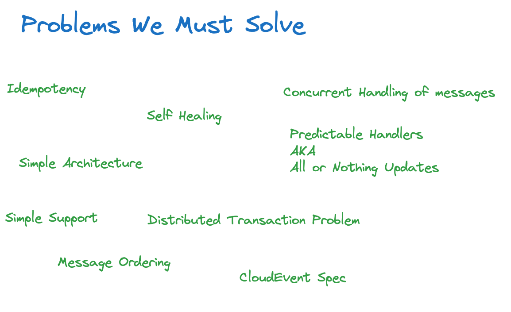
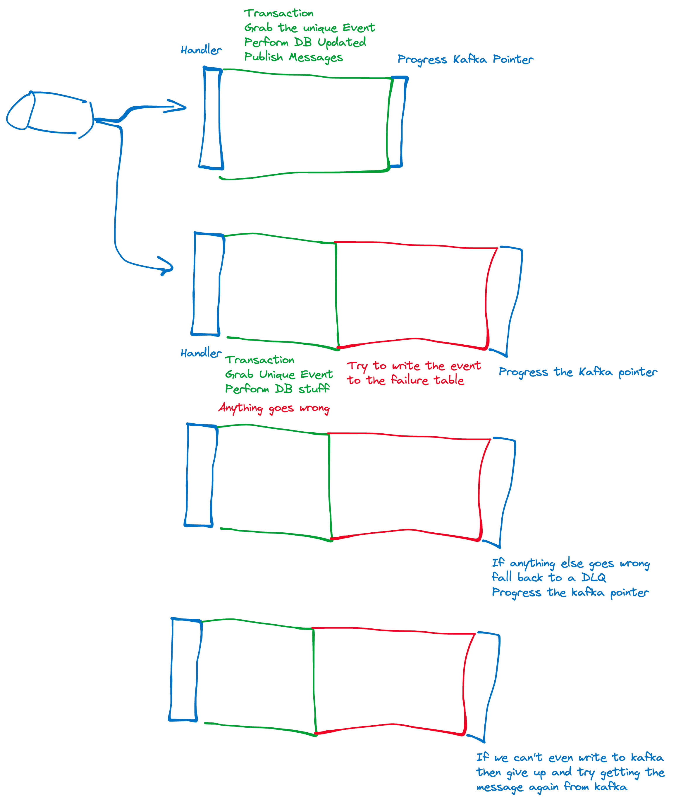

# Welcome

This is an some demonstration code to help demonstrate a very simple solution that can be used to easily handle 1000s of message per seconds reliably in production for the every day developer.

Take a look at some of the code, try it yourself.

### Hints

This code can be run on your laptop so long as you have java 17 and docker installed. All other dependencies are pulled in as part of the build including an embedded kafka and a test containers postgres instance.

Feel free to also copy the testing style for your integration tests. They are expensive tests (approx 2-3 seconds) however they will test your configuration etc and can be really useful for automated end to end tests debugging your code locally without a test environment ;).

## Common Problems we need to solve

_Here come some buzz words_

## Opinionated Solution following a simple architecture

_Simple explanation of the solution_

